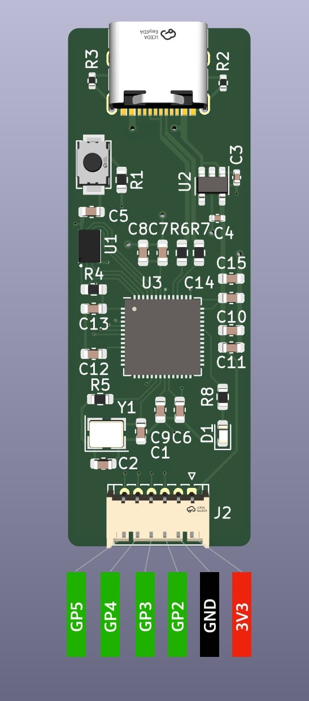

## RP-Link

基于 [Picoprobe](https://github.com/raspberrypi/picoprobe) 的 [树莓派Pico](https://www.raspberrypi.com/documentation/microcontrollers/raspberry-pi-pico.html) 调试器。

- 原理图在：[RP-Link.pdf](./RP-Link.pdf)

- 实物图在： [static/RP-Link_.jpeg](./static/RP-Link_.jpeg)

- bom表在：[bom/ibom.html](./bom/ibom.html)
- genber文件在：[genber/](./genber/)

- 引脚定义如下图：

</img>

> PCB设计参考自：[raspberry pi pico](https://www.raspberrypi.com/documentation/microcontrollers/) 和 [EnvOpenPico](https://github.com/Envious-Data/EnvOpenPico)

## 更多

[使用 CLion 调试树莓派 Pico](./doc/使用CLion调试树莓派Pico.md)

生成交互式Bom表单的插件为：[InteractiveHtmlBom](https://github.com/openscopeproject/InteractiveHtmlBom)

picoprobe 可执行文件可以在 [Releases](https://github.com/swpfY/RP-Link/releases) 中找到

> 🤪目前刚入门水平有限，还在学习，后续会继续优化迭代

